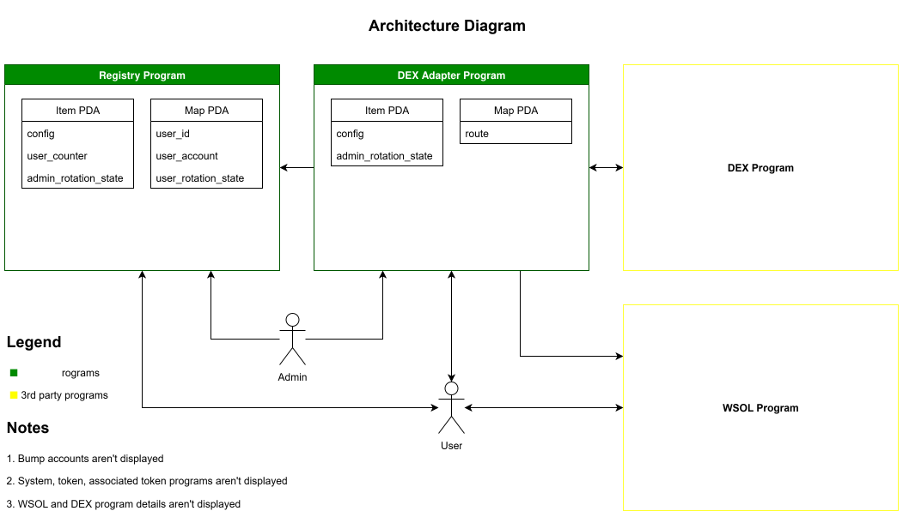
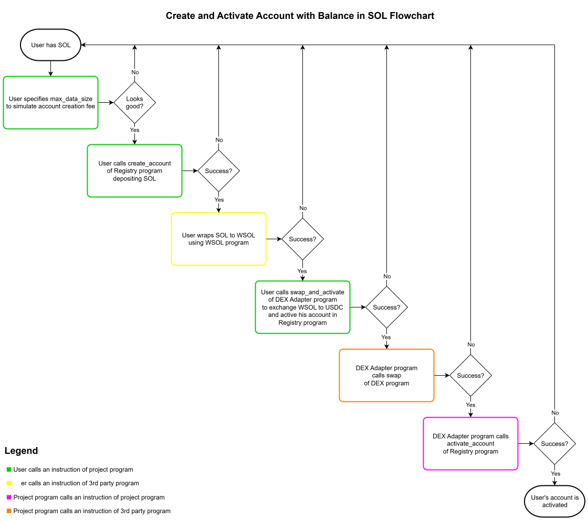
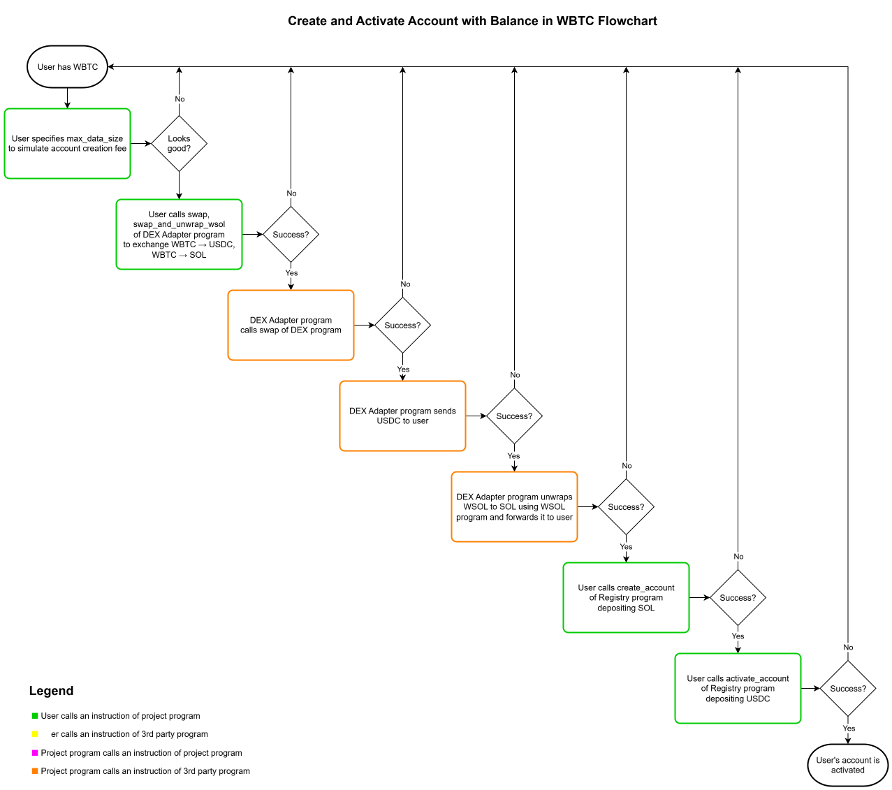
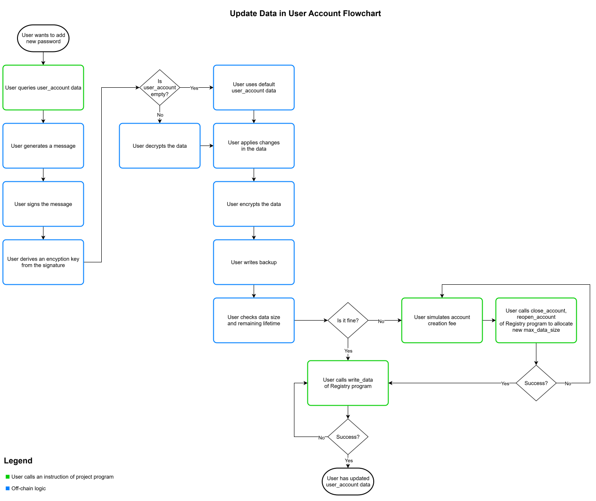
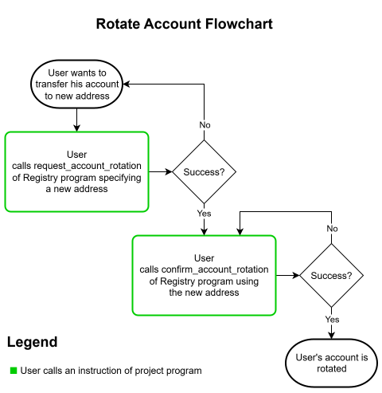

# SolVeil

## Overview

SolVeil (Solar Veil) is a decentralized password manager that combines self-custody security with blockchain-based data persistence. Users maintain complete control over their encrypted data while optionally leveraging Solana blockchain storage for enhanced reliability and cross-device synchronization.

This repository contains the **smart contracts** that power SolVeil's on-chain functionality.

[The application](https://solveil.cryptogopniks.xyz)

[Frontend repository](https://github.com/MedvedCrypto/SolVeil-UI)

## Key Features

- **Crypto Wallet Integration**: Uses browser wallet signatures for encryption key derivation
- **Dual Storage Model**: Free local backups with optional paid on-chain storage
- **Self-Custody Security**: No master passwords stored, wallet-based encryption
- **Cross-Device Sync**: Smart conflict resolution when merging data across devices
- **Payment Flexibility**: Accepts different tokens for account creation and storage rent
- **Account Migration**: Secure two-step process for moving accounts between wallet addresses

## How It Works

### Encryption Model
- Uses Ed25519 wallet signatures to derive encryption keys via HKDF
- AES-GCM-SIV encryption for data protection
- No direct access to private keys or seed phrases required

### Storage Architecture
1. **Local Storage** (Free): Encrypted JSON backups with automatic conflict resolution
2. **On-Chain Storage** (Paid): Encrypted data stored on Solana with rent-based pricing

### Data Structure
```typescript
interface DataRecord {
  Date: number;      // Unix timestamp of last modification
  label: string;     // User-defined service label  
  password: string;  // Encrypted password
  note: string;      // Optional notes/comments
}

interface Backup {
  nonce: number;     // Encryption nonce
  data: string;      // Base64 encoded encrypted data
}
```

### Smart Contract Features
- **Account Management**: Create, activate, and migrate user accounts
- **Storage Allocation**: Dynamic storage space management with rent calculation
- **Payment Processing**: Multi-token support (SOL, USDC, WBTC) with DEX integration
- **Data Operations**: Encrypted data storage and retrieval
- **Security**: Account rotation and access control mechanisms

## Diagrams

### Architecture Diagram


### Create and Activate Account with SOL Flowchart


### Create and Activate Account with WBTC Flowchart


### Update Data in User Account Flowchart


### Rotate Account Flowchart


## Development Workflow

1. Generate program ID and update it in files
```sh
./program_id.sh registry
```

2. Build programs
```sh
./build.sh
```

3. Test programs
* with rebuilding (required if a program was changed)
```sh
./test.sh
```
* w/o rebuilding (faster option)
```sh
./test.sh l
```

4. Deploy programs
```sh
clear && ./deploy.sh devnet registry
```

## WARNING: NOT FOR COMMERCIAL USE

This repo is under a business source license simliar to Uniswap V3. This means it is **not available** under an open source license for a period of time. Please see [LICENSE](LICENSE) for full details.

## DISCLAIMER

SOLVEIL IS PROVIDED “AS IS”, AT YOUR OWN RISK, AND WITHOUT WARRANTIES OF ANY KIND. No developer or entity involved in creating or deploying SolVeil smart contracts will be liable for any claims or damages whatsoever associated with your use, inability to use, or your interaction with other users of SolVeil, including any direct, indirect, incidental, special, exemplary, punitive or consequential damages, or loss of profits, cryptocurrencies, tokens, or anything else of value.
